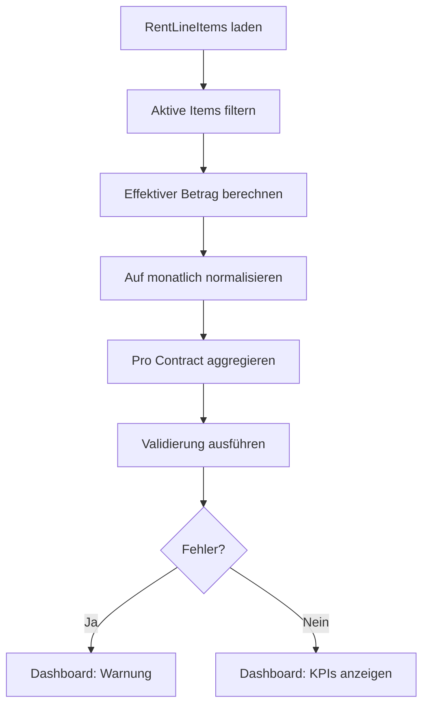

# AERA SCALE — KPI-Definitionen

Dieses Dokument definiert alle Dashboard-KPIs verbindlich.
Alle Werte basieren ausschließlich auf der `RentLineItem`/`Contract`-Datenstruktur.

---

## 1. Monthly Recurring Rent (MRR)

| Eigenschaft | Wert |
|-------------|------|
| **Formel** | `Σ normalizeToMonthly(effectiveAmount(item))` für alle aktiven, wiederkehrenden RentLineItems |
| **Einschluss** | `cadence ∈ {monthly, quarterly, yearly}` und `isActive === true` |
| **Ausschluss** | `cadence === 'one-time'`, inaktive Items, Items außerhalb `[startDate, endDate]` |
| **Normalisierung** | `quarterly → amount / 3`, `yearly → amount / 12` |
| **Indexierung** | Effektiver Betrag = neuester `adjustmentHistory`-Eintrag ≤ Monatsende |
| **Aggregation** | Über `rent_line_item_id` (dedupliziert), gruppiert nach `contract_id` |
| **Anti-Doppelzählung** | Set-Prüfung auf `rent_line_item_id` vor Aggregation |

---

## 2. One-Time Revenue

| Eigenschaft | Wert |
|-------------|------|
| **Formel** | `Σ amount` für alle One-Time-Items mit `startDate ∈ targetMonth` |
| **Einschluss** | `cadence === 'one-time'`, `isActive === true`, `startDate` im Zielmonat |
| **Ausschluss** | Wiederkehrende Items |

---

## 3. Gross Rent (Bruttomiete)

| Eigenschaft | Wert |
|-------------|------|
| **Formel** | `MRR + One-Time Revenue` |
| **Hinweis** | Enthält alle Positionen (Kaltmiete + NK + Service Fees + Sonstiges) |

---

## 4. Net Rent (Nettomiete / Kaltmiete)

| Eigenschaft | Wert |
|-------------|------|
| **Formel** | `Σ normalizeToMonthly(effectiveAmount(item))` für `type === 'base_rent'` |
| **Einschluss** | Nur Items mit `type === 'base_rent'` |
| **Ausschluss** | NK-Vorauszahlungen, Service Fees, Parkplätze, etc. |

---

## 5. NK-Vorauszahlungen (Ancillary Prepayments)

| Eigenschaft | Wert |
|-------------|------|
| **Formel** | `Σ normalizeToMonthly(effectiveAmount(item))` für `type === 'ancillary_prepayment'` |

---

## 6. Occupancy Rate

| Eigenschaft | Wert |
|-------------|------|
| **Formel** | `Vermietete Units / Gesamt Units × 100` |
| **Datenquelle** | `PropertyUnit.status` + `Contract`-Zuordnung |

---

## Konfigurationspunkte

| Parameter | Standard | Beschreibung |
|-----------|----------|--------------|
| `percentThreshold` | 0.5% | Max. relative Abweichung für CALC_MISMATCH |
| `absoluteThreshold` | 5 EUR | Max. absolute Abweichung für CALC_MISMATCH |
| `maxMonthlyDelta` | 25% | Max. MRR-Sprung Monat-über-Monat vor ANOMALY-Flag |
| `allowedCurrencies` | `['EUR']` | Zulässige Währungen (Mischung → CURRENCY_MIX) |

---

## Validierungsflags

| Flag | Schwere | Auslöser |
|------|---------|----------|
| `CALC_MISMATCH` | error | `|computedMRR - expectedMonthlyTotal| > max(0.5%, 5€)` |
| `DUPLICATE_LINEITEM` | error | `rent_line_item_id` mehrfach im Aggregat |
| `NEGATIVE_AMOUNT` | warning | Negativer Betrag ohne `type ∈ {discount, credit_note}` |
| `ANOMALY` | warning | MRR-Delta > 25% ohne Indexierung |
| `CURRENCY_MIX` | error | Währung ∉ `allowedCurrencies` |

---

## Berechnungsreihenfolge

